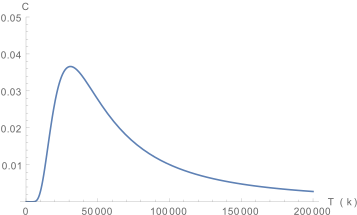
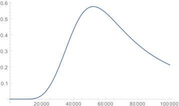

# spinIceStatSumm
Расчет статсуммы решетки спинового льда для различного числа частиц

В эксперименте считается статсумма системы решетки спинового льда (квадратной) и сохраняется в файл.
В файле checkYourself.nb вычисляется энергия такой решетки для 4 частиц.

### Эксперименты
Рассматривается решетка из частиц  размером 80х220 нанометров, параметр решетки 400нм.
Намагниченность одной частицы 3*10^7 магнетонов Бора.
В statSumm2Parts.nb хранится статсумма для 2 частиц и построен график теплоемкости.
В statSumm12Parts.nb хранится статсумма для 12 частиц и построен график теплоемкости.

Теплоемкость для 2 частиц

Теплоемкость для 12 частиц

