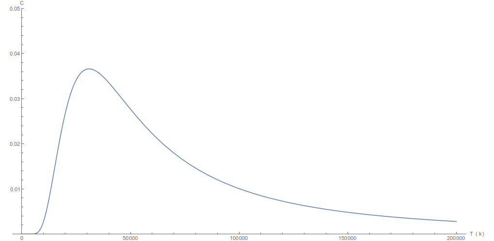
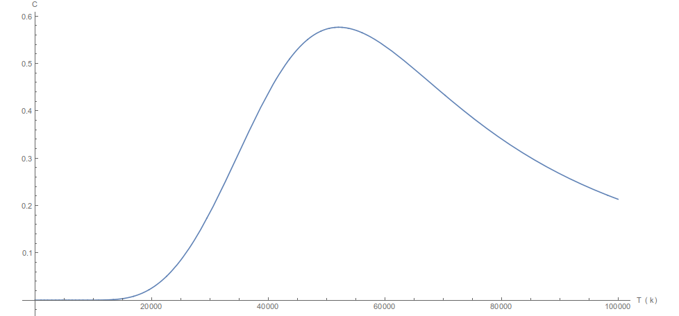
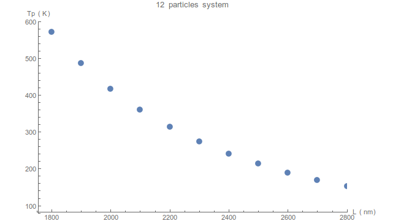

# spinIceStatSumm
Расчет статсуммы решетки спинового льда для различного числа частиц

В эксперименте считается статсумма системы решетки спинового льда (квадратной) и сохраняется в файл.
В файле checkYourself.nb вычисляется энергия такой решетки для **4** частиц.

### Эксперименты
Рассматривается решетка из частиц  размером 80х220 нанометров, параметр решетки **400**нм.
Намагниченность одной частицы **3*10^7** магнетонов Бора.
В statSumm2Parts.nb хранится статсумма для **2** частиц и построен график теплоемкости.
В statSumm12Parts.nb хранится статсумма для **12** частиц и построен график теплоемкости.

Теплоемкость для 2 частиц

Теплоемкость для 12 частиц

Зависимость температуры пика теплоемкости от параметра решетки системы из **12** частиц

В эксперименте макроспин рассматривался как точечный анизотропный диполь, следовательно,
не учитывались процессы, происходящие внутри диполя при изменении температуры.
Известно, что пик теплоемкости для частицы пермаллоя составляет порядка 300 кельвин.
Следовательно, намагниченность каждого макроспина пропадет при более низкой температуре,
чем теплоемкость всей системы (та, что на графике) достигнет своего пика.
Однако, для систем с параметром решетки более 2250нм, возможно экспериментально наблюдать
аномалии систем, находящихся в состоянии T=Tc, либо T>Tc.

Чем обусловлено наличие пика теплоемкости в таких системах?

Какие состояния наблюдаются в системах при T<Tc;T=Tc;T>Tc? Чем они схожи/различны?

Изменится ли график теплоемкости при изменении материала и размера магн. системы?
Для примера, можно рассмотреть 24/32/60/112 частиц.

Если изменится график, то сменится температура пика, либо лишь его значение?
